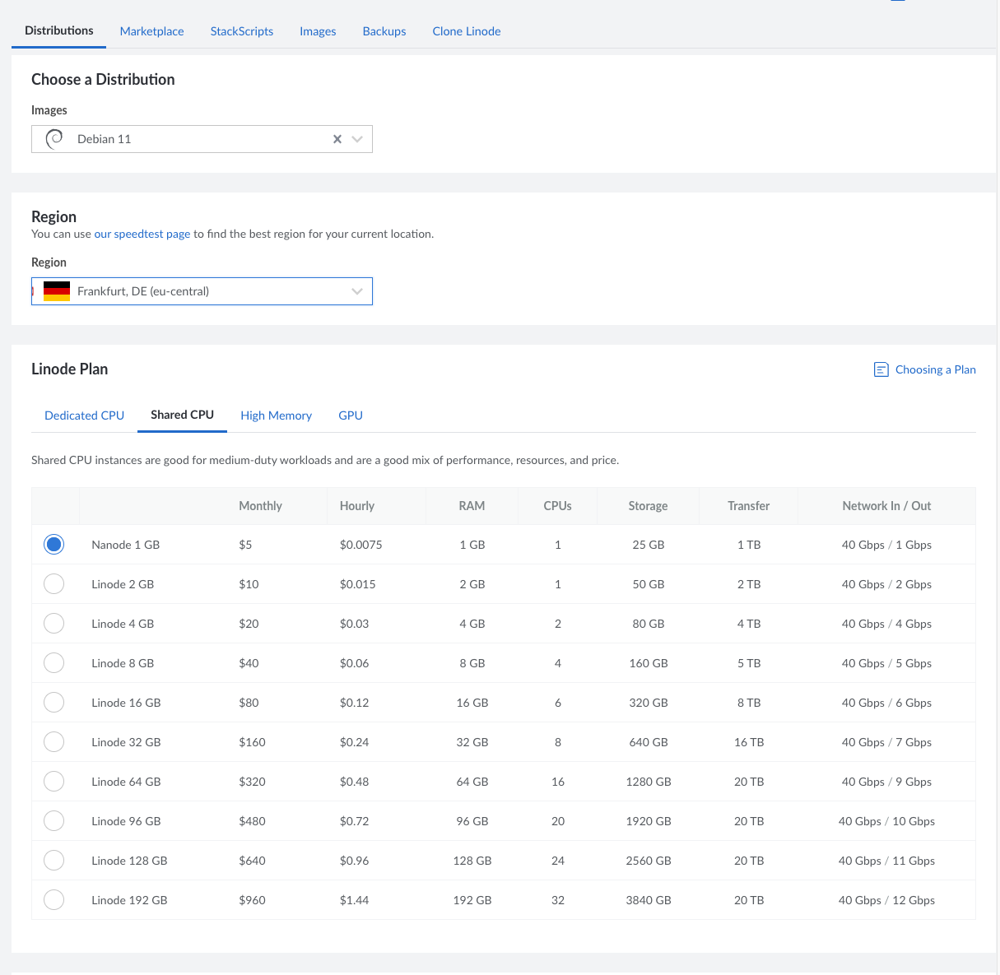

# Real Internet

## First Steps

https://terokarvinen.com/2017/first-steps-on-a-new-virtual-private-server-an-example-on-digitalocean/

* first time log in as root

* before you enable the ufw firewall remember to leave a hole for ssh connection in port 22/tcp

* create user a user for yourself

* close root account

* update and updgrade

## Rent-a-server

I decided to use Linode to rent a server. I chose Debian 11 and enabled SSH key login.

## Basic setup

I logged in the server via SSH and started with installing ufw firewall and poke a hole .

	root@localhost:~# apt-get update
	root@localhost:~# apt-get install ufw
	root@localhost:~# sudo ufw allow 22/tcp
	Rules updated
	Rules updated (v6)
	root@localhost:~# sudo ufw enable
	Command may disrupt existing ssh connections. Proceed with operation (y|n)? y
	Firewall is active and enabled on system startup

Then I created a new user which and gave it sufficient privileges:

	root@localhost:~# sudo adduser teemu
	root@localhost:~# sudo adduser teemu sudo
	root@localhost:~# sudo adduser teemu adm

Now I tested in a new terminal that I can log in with the new user. It worked so I went forward with locking the root account.

	root@localhost:~# usermod --lock root
	root@localhost:~# sudoedit /etc/ssh/sshd_config

Then I logged in with the new user and updated and upgraded packages and installed micro and set the timestamp in the prompt:

	teemu@localhost:~$ sudo apt-get update
	teemu@localhost:~$ sudo apt-get upgrade
	teemu@localhost:~$ vim .bashrc
	teemu@localhost:~$ source .bashrc
	17:10:58 [teemu@localhost ~]$ sudo apt-get install micro

## Install Apache

Then I decided to install Apache server and opened a port for it in the firewall:

	17:22:13 [teemu@localhost ~]$ sudo apt-get install apache2
	17:33:16 [teemu@localhost ~]$ sudo ufw allow 80/tcp
	17:34:51 [teemu@localhost ~]$ sudo systemctl start apache2

I tested from my local machines shell. 

➜  ~ curl 143.42.59.197

Which responded with the Apache default page. Let's replace it next.

17:46:28 [teemu@localhost ~]$ sudoedit /var/www/html/index.html

And test from local machine:

	➜  ~ curl 143.42.59.197
	<!doctype html>
		<html lang="en">
		<head>
			<title>Teemun sivut</title>
			<meta charset="utf-8"/>
		</head>
		<body>
			<h1>I dare you:</h1>
			<button type="button">CLICK MEEE!!!!</button>
		</body>
	</html>

That's good for now.

## Burglars

Let's see if someone is trying to break in.

	17:54:22 [teemu@localhost ~]$ tail -2 /var/log/auth.log
	Feb  8 17:49:16 localhost sshd[3591]: Failed password for invalid user PPSNEPL from 116.72.230.182 port 57871 ssh2
	Feb  8 17:49:20 localhost sshd[3591]: Connection closed by invalid user PPSNEPL 116.72.230.182 port 57871 [preauth]

This looks to me that some one is trying to knock on ports and establish an connection on my server.

## The Next Day

Now I have time so I decided to enable the use of user directories as webpages. Then I created the configuration file and added some content to the target directory.

	06:23:11 [teemu@localhost ~]$ sudo a2enmod userdir
	Enabling module userdir.
	To activate the new configuration, you need to run:
	 systemctl restart apache2
	06:25:51 [teemu@localhost ~]$ sudoedit /etc/apache2/sites-available/frontpage.conf
	06:28:01 [teemu@localhost ~]$ sudo a2ensite frontpage.conf
	Enabling site frontpage.
	To activate the new configuration, you need to run:
	  systemctl reload apache2
	06:28:27 [teemu@localhost ~]$ sudo systemctl restart apache2
	06:29:09 [teemu@localhost ~]$ mkdir public_sites
	06:29:20 [teemu@localhost ~]$ cd public_sites/
	06:29:22 [teemu@localhost public_sites]$ micro index.html

And test from my local shell:

	➜  ~ curl 143.42.59.197
	<!doctype html>
	<html lang="en">
		<head>
			<title>Teemun sivut</title>
			<meta charset="utf-8"/>
		</head>
		<body>
			<h1>I dare you:</h1>
			<button type="button">CLICK MEEE!!!!</button>
		</body>
	</html>
